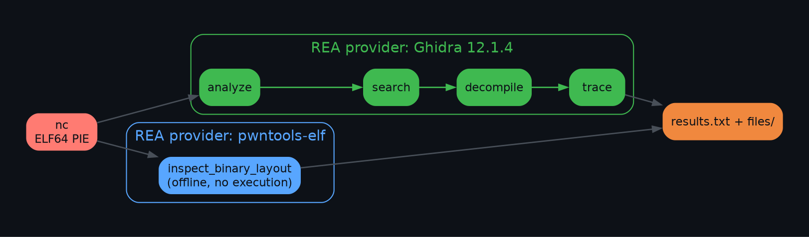
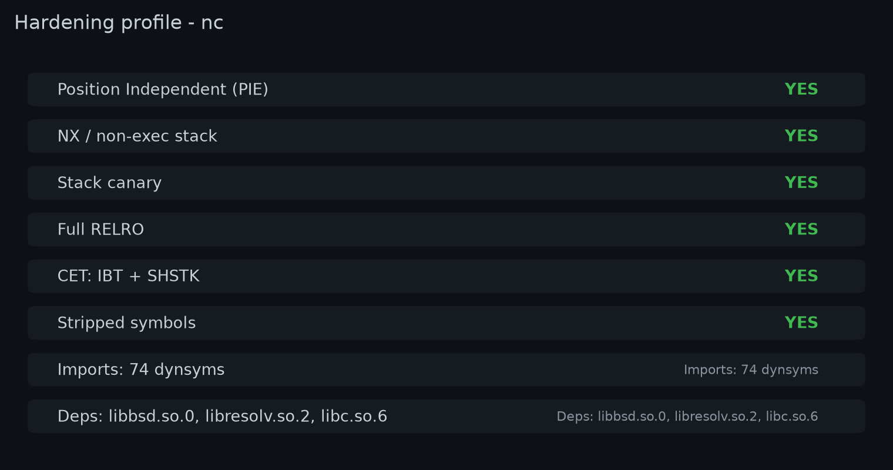
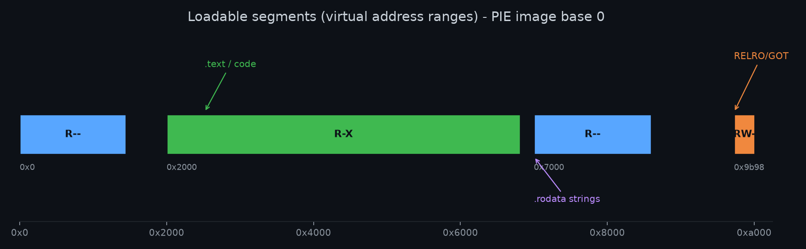
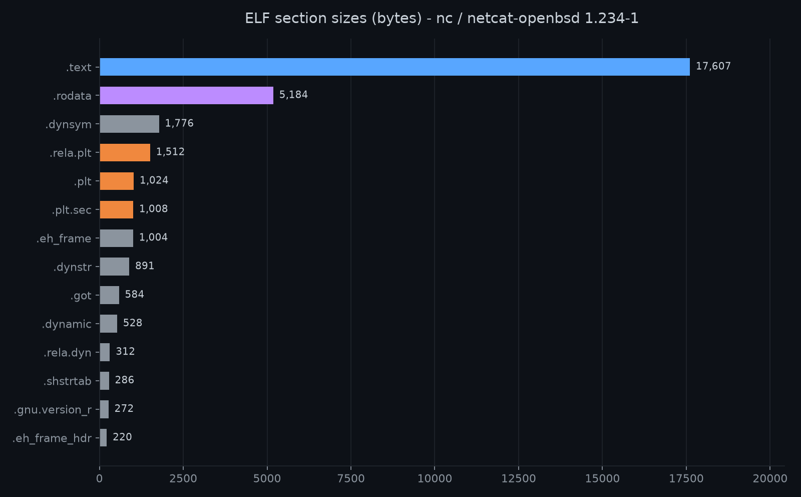
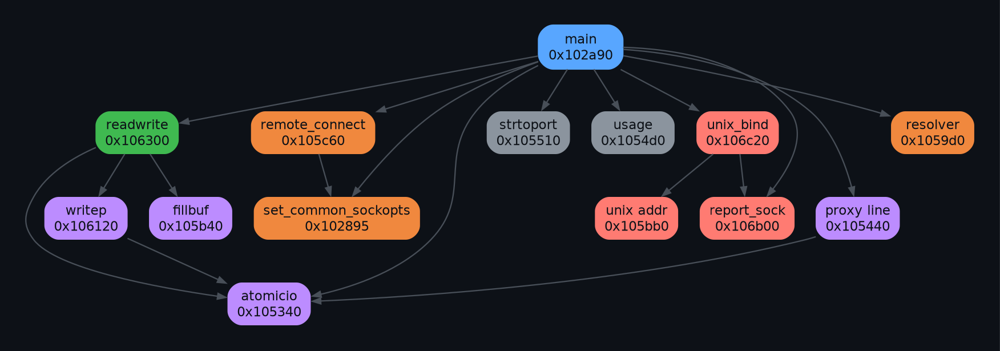

<div align="center">

# REA · OpenBSD `nc`

### Reverse-engineering the Ubuntu `netcat-openbsd 1.234-1` binary with [REA](https://github.com/morluto/rea) — "Reverse Engineer Anything"

[](https://github.com/morluto/rea)
[](https://ghidra-sre.org)
[](https://launchpad.net/ubuntu/+source/netcat-openbsd)
[](#reproduce)
[](LICENSE)

A complete, reproducible static reverse-engineering pass over a stripped,
position-independent `nc` binary: identity, hardening, layout, call graph and
decompiled pseudocode — produced without ever executing the target.



</div>

---

## TL;DR

| | |
|---|---|
| **What it is** | Stock Ubuntu/Debian **`netcat-openbsd 1.234-1`** (`OpenBSD netcat`, Debian patchlevel) |
| **Format** | ELF64 · x86-64 · little-endian · PIE (`ET_DYN`) · **stripped** |
| **SHA-256** | `de49cac83b4645476865e1faa39ac6c9e833baa1ea26fde02ec8045ec71a160d` |
| **Verdict** | No evidence of custom or trojanized code — packaging note, banner, option table and imports all match the upstream package |
| **Hardening** | Full RELRO · NX · stack canary · CET (IBT + SHSTK) |
| **Recovered** | `main` + 24 helpers, ~130 `.rodata` strings, full call graph, Ghidra pseudocode |

> Full write-up: [`results.txt`](results.txt) · artifact index: [`files/README.md`](files/README.md)

---

## How we used REA

REA is an MCP/CLI reverse-engineering tool that drives analysis engines and
returns **evidence** with every result. We used two providers on the same
target:

**1 — Offline ELF layout (`pwntools-elf`), no execution**

```bash
REA_PWNTOOLS_PYTHON=./env/bin/python \
  rea inspect-binary-layout nc --json        # sections, symbols, relocs, prot
```

Pinned, isolated `pwntools 4.15.0` · `pyelftools 0.33` · `unicorn 2.1.2`.

**2 — Deep analysis via Ghidra 12.1.4 headless**

```bash
export GHIDRA_INSTALL_DIR=/opt/ghidra_12.1.4_PUBLIC
export JAVA_HOME=/opt/jdk-21                          # Ghidra rejects JDK 25

rea analyze  nc --provider ghidra --snapshot files/rea_snapshot.json --json
rea search   nc --kind procedures --provider ghidra --json
rea search   nc --kind strings    --provider ghidra --json
rea decompile nc 0x102a90         --provider ghidra --json   # main
rea trace    nc "OpenBSD netcat (Debian patchlevel 1.234-1)" --provider ghidra --json
```

REA imported the image at base `0x100000`, ran Ghidra's default auto-analysis,
then answered targeted queries. We decompiled `main` plus **every** helper and
cross-checked with `readelf`/`objdump`/`nm`/`strings`. Upstream `netcat.c` was
consulted **only** to name functions — the binary is the source of truth.

---

## What we found

<div align="center">

### Hardening profile



### Memory layout



### Section sizes



### Call graph



</div>

---

## Function map

`main` is a single 10 KB function (GCC hot/cold splitting + aggressive
inlining); the remaining logic lives in ~24 helpers (`file vaddr` shown).

| Address | Function | Role (evidence-based) |
|---|---|---|
| `0x02a90` | **`main`** | Options, SOCKS4/4A/5 + HTTP CONNECT proxy, listen/connect dispatch |
| `0x5340` | `atomicio` | read/write retry on `EINTR`/`EAGAIN` with `poll` |
| `0x5440` | proxy line | HTTP proxy response reader (≤1024 bytes, until `LF`) |
| `0x54d0` | `usage` | short usage text |
| `0x5510` | `strtoport` | numeric port or `getservbyname` lookup |
| `0x55b0` | sockopt/connect helper | applies common socket options on connect paths |
| `0x59d0` | resolver | `getaddrinfo` → `sockaddr_storage` |
| `0x5b40` | `fillbuf` | buffered read, `EAGAIN`/`EINTR` aware |
| `0x5bb0` | unix addr | builds UNIX sockaddr (abstract `@` paths) |
| `0x5c60` | `remote_connect` | timeout `connect`, verbose `getnameinfo`, min-TTL check |
| `0x6120` | `writep` | write with `-C` CRLF translation + `-q` delay |
| `0x6300` | `readwrite` | main `poll` loop, 16 KB buffers |
| `0x6b00` | `report_sock` | `"%s on %s %s"` verbose reporting |
| `0x6c20` | `unix_bind` | UNIX socket create/bind (abstract-aware) |
| `0x0895` | `set_common_sockopts` | TTL/ToS/IPv6 hop limit, TCP buffer sizes |

<sub>Full table incl. callers/callees and per-function evidence strings:
[`files/function_inventory.md`](files/function_inventory.md).</sub>

---

## Capabilities recovered

- **Modes** — TCP connect, TCP listen (`-l`), UDP (`-u`), UNIX domain (`-U`),
  DCCP (`-Z`), zero-I/O scan (`-z`), keep-listening (`-k`), detach (`-d`).
- **Proxy** (inlined in `main`) — SOCKS4/4A/5 with auth, HTTP `CONNECT`
  tunnelling, Basic auth, `200`/`407` handling, passwords via `readpassphrase`,
  base64 via `__b64_ntop`.
- **Socket options** — TTL/hop-limit (`-M`), min-TTL (`-m`), TOS keywords
  (`-T`: `critical`/`inetcontrol`/`lowcost`/`lowdelay`/`reliability`/`throughput`),
  TCP send/recv buffers (`-I`/`-O`), `SO_REUSEADDR`/`SO_REUSEPORT`, broadcast
  (`-b`), TCP MD5SIG (`-S`), source address (`-s`).
- **Data path** — `readwrite`/`writep`/`fillbuf`, `-C` CRLF translation,
  telnet negotiation (`-t`), fd passing (`-F`).
- **No TLS** — the binary does not link `libtls`/`libssl`, so upstream TLS paths
  are compiled out (matches the Ubuntu package).

---

## Repo layout

```
.
├── README.md                 # this file
├── LICENSE                   # MIT
├── NOTICE                    # upstream BSD attribution
├── results.txt               # full analysis report
├── assets/                   # README visuals (generated)
├── tools/make_assets.py      # regenerates assets/ from files/
└── files/                    # all evidence + raw outputs
    ├── README.md             # artifact index
    ├── layout_summary.md
    ├── function_inventory.md / .tsv
    ├── decompiled_functions.c
    ├── rea-*.json            # canonical REA evidence
    └── *.txt                 # readelf / objdump / nm / strings
```

## Reproduce

```bash
npm i -g rea-agents                       # or: npx rea-agents@latest ...
# point REA at a Ghidra 12.1.x install + JDK 21 (see files/README.md)
rea analyze nc --provider ghidra --json
python3 tools/make_assets.py              # rebuild the figures
```

## Confidence & limits

- **Identity / hardening / linkage** — high (static ELF facts).
- **Function roles** — medium (Ghidra auto-names; roles inferred from string
  cross-references and the call graph, so inlining blurs a few boundaries).
- No runtime/dynamic analysis; all addresses are **linked** addresses (base 0).

---

<div align="center">

**Analysis:** [REA v6.2.0](https://github.com/morluto/rea) · Ghidra 12.1.4
**Target:** `netcat-openbsd 1.234-1` (Ubuntu)
**License:** MIT — see [`LICENSE`](LICENSE) & [`NOTICE`](NOTICE)

</div>
